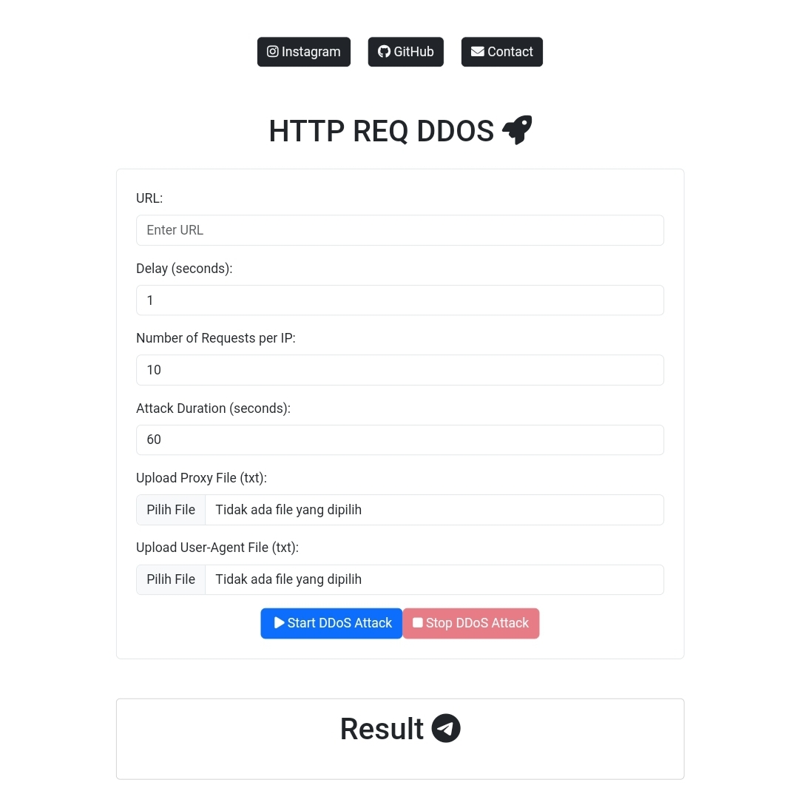

<h2 align="center">HTTP ExpressJS Floods Traffic</h1>

<p align="center">
    
</p>

#### The following is Information in details input


| Input       | Information Details |
|-----------|-------------|
| URL    | Put with first `http://` |
| Delay     | Delay for Request Attack |
| Request per IP     | Whatever what you want put this number |
| Attack Duration  | Delay for Long Attack |
| Upload Proxy    | Create a file with any name, but with the `extension .txt` which contains a `proxy list` |
| Upload User-Agents     | Create a file with any name, but with the `extension .txt` which contains a `User-Agents list` |

#### Requirements

```javascript
npm install express cloudscraper ws multer fs path
```

#### Installation


```javascript
git clone https://github.com/bovalonee/webjsflood.git && cd webjsflood
```

#### Lets try

```javascript
node app.js
```

#### Ngrok server

Put online scripted for free use ngrok!  [Register Ngrok](https://dashboard.ngrok.com/).


- Installation resource ngrok

```javascript
curl -s https://ngrok-agent.s3.amazonaws.com/ngrok.asc | sudo tee /etc/apt/trusted.gpg.d/ngrok.asc >/dev/null && echo "deb https://ngrok-agent.s3.amazonaws.com buster main" | sudo tee /etc/apt/sources.list.d/ngrok.list && sudo apt update && sudo apt install ngrok
```
- Change this `<token>` with u token ngrok

```javascript
ngrok config add-authtoken <token>
```

- adjust the port u want to use, 3000 has been provided as in the script.

```javascript
ngrok http 3000
````

#### License

Licensed under the [MIT License](https://github.com/bovalonee/webjsflood/blob/main/LICENSE).
